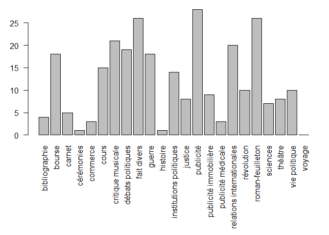
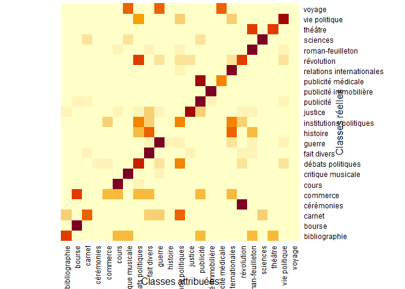
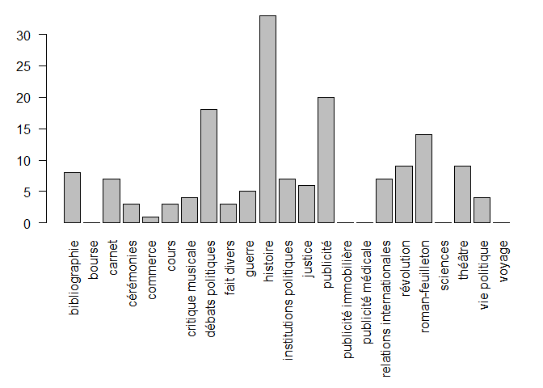

TP R 05
================
Léo Dumont
2024-04-15

La ligne ci-dessous permet d’affcher le code des blocs lors de
l’exportation vers un document PDF ou HTML

# Préparer son environnement de travail

1.  Il faut commencer par définir un répertoire de travail via le menu
    `Session` \> `Set Working Directory` \> `Choose Directory`.
2.  Dans les options du fichier Rmarkdown (icône en forme d’engrenage)
    choisir l’option `Chunck Output In Console`.

``` r
source(file = "fonctions_texto.r")
```

# Chargement des paquets

``` r
# install.packages("readtext")
# install.packages("quanteda")
# install.packages("quanteda.textmodels")

library(readtext)
library(quanteda)
```

    ## Package version: 4.0.1
    ## Unicode version: 15.1
    ## ICU version: 74.1

    ## Parallel computing: 4 of 4 threads used.

    ## See https://quanteda.io for tutorials and examples.

    ## 
    ## Attachement du package : 'quanteda'

    ## L'objet suivant est masqué depuis 'package:readtext':
    ## 
    ##     texts

``` r
library(quanteda.textmodels)
```

# Définition des données d’entraînement et des données de test

## Importation des textes et création du corpus

``` r
csvf <- "genres_étiquetés_1840-1860.csv"

textes <- readtext(csvf, text_field = "text")
numapresse <- corpus(textes)
```

## Segmentation lexicale

``` r
occurrences <- tokens(numapresse,
                      remove_punct = T,
                      remove_symbols = T,
                      remove_numbers = T,
                      split_hyphens = F)

occurrences <- tokens_split(occurrences, "'")
```

## Retrait des stopwords

``` r
stopwords_fr <- read.csv("stopwords_fr.csv",  encoding="utf-8")
toks_nostop <- tokens_remove(occurrences, stopwords_fr$fg, padding = FALSE)
```

## Création de la DFM

``` r
numapresse_dfm <- dfm(toks_nostop, remove_padding = TRUE)
ndoc(numapresse_dfm)
```

    ## [1] 1274

``` r
id_train <- sample(1:1274, 1000, replace = FALSE)
```

## Extraction DFM données d’entraînement

``` r
dfm_entrainement <- dfm_subset(numapresse_dfm, id %in% id_train)
```

## Extraction DFM données de test

``` r
dfm_test <- dfm_subset(numapresse_dfm, !id %in% id_train)
```

## Classification SVM (Machines à vecteurs de support)

``` r
tmod_svm <- textmodel_svm(dfm_entrainement, dfm_entrainement$label)
```

## Récupération des labels attribués manuellement

``` r
classes_reelles <- dfm_test$label
```

## Application du modèle aux données de test

``` r
classes_predites <- predict(tmod_svm, newdata = dfm_test)
```

    ## Warning: 6878 features in newdata not used in prediction.

## Visualisation des classes prédites

``` r
par(mar=c(10.5,3,1,1))
plot(classes_predites,las=2)
```

<!-- -->

## Création de la matrice de confusion

``` r
mat_confusion <- table(actual = classes_reelles, predicted = classes_predites)

write.csv(mat_confusion, "matrice_confusion.csv")

heatmap(mat_confusion,
        Rowv = NA,
        Colv = NA,
        xlab="Classes attribuées",
        ylab="Classes réelles")
```

<!-- -->

## Calcul du taux d’exactitude

``` r
sum(diag(mat_confusion))/sum(mat_confusion)
```

    ## [1] 0.6131387

# Application du modèle au corpus Charlemagne

## SVM sur la totalité du corpus d’entraînement

``` r
tmod_svm <- textmodel_svm(numapresse_dfm, numapresse_dfm$label)

## Importation des textes et création du corpus

csvf <- "charlemagne_jdd_1838-1861.csv"
textes <- readtext(csvf, text_field = "text", docid_field = "document")
debats <- corpus(textes)
```

## Segmentation lexicale

``` r
occurrences <- tokens(debats,
                      remove_punct = T,
                      remove_symbols = T,
                      remove_numbers = F,
                      split_hyphens = F)
occurrences <- tokens_split(occurrences, "'")
```

## Retrait des stopwords

``` r
stopwords_fr <- read.csv("stopwords_fr.csv",  encoding="utf-8")
toks_nostop <- tokens_remove(occurrences, stopwords_fr$fg, padding = FALSE)
```

## Création de la DFM

``` r
debats_dfm <- dfm(toks_nostop)
```

## Application modèle aux données charlemagne

``` r
classes_predites <- predict(tmod_svm, newdata = debats_dfm)
```

    ## Warning: 5305 features in newdata not used in prediction.

## Visualisation des classes prédites

``` r
par(mar=c(10.5,3,1,1))
plot(classes_predites,las=2)
```

<!-- -->

## Récupération des résultats de la classification dans la DFM

``` r
debats_dfm$labels <- classes_predites
```

## Exportation vers AFC

``` r
top300 <- names(topfeatures(debats_dfm, n = 300))
debats_dfm_300 <- dfm_select(debats_dfm, pattern = top300, selection = "keep")
dfm_l <- dfm_group(debats_dfm_300, groups = labels)
tle <- dfm_to_tle(dfm_l)
write.csv(tle, "table_lexicale_labels_300.csv", row.names = TRUE)
```
