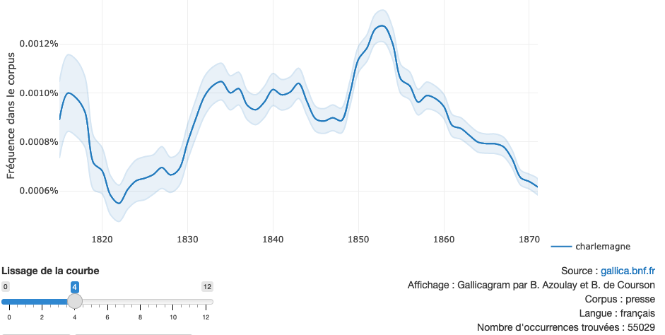
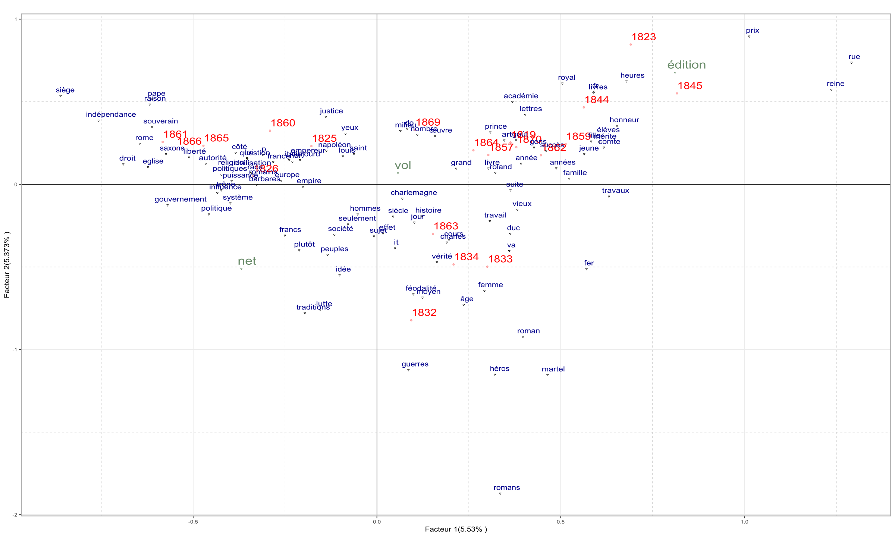

**Attention**, ce document est en cours de rédaction. Il s'agit d'une version de travail amenée à évoluer.

# Présentation du corpus

## Quel corpus pour quelles questions ? (Lola)

Du croisement du Romantisme dans sa volonté de réhabiliter le Moyen Âge
et le nationalisme croissant qui revendique des symboles puissants
d’identité collective, émerge la figure identificatoire emblématique du
19e siècle : l’empereur carolingien Charlemagne. (…) Une telle
universalité n’est possible que grâce à la plasticité extraordinaire de
cette figure. La diversité des activités du Charlemagne historique, y
compris ses succès militaires, ses réformes juridiques et éducatifs et
sa relation avec l’Église permettent de lui attribuer des qualités
multiples en fonction de l’objectif du locuteur. Les visages multiples
de Charlemagne ont la capacité de servir de permettre l’ancrage dans le
passé glorieux de toute sorte de projet. L’étude de
l’instrumentalisation de la figure de l’empereur laisse également
identifier les liens réunissant les différents champs et régimes
politiques de la France du 19e siècle et les thèmes centraux de leurs
discours. Cette plasticité reflète le fait que le Charlemagne auquel le
19e siècle fait référence n’est pas identique à la réalité historique du
personnage. La figure moderne se situe là « où se rejoignent et se
confondent mythe, histoire et poétique »[^1]. De cette fusion témoigne
entre autres l’ouvrage La Gaule poétique : l’Histoire de France
considérée dans les rapports avec la poésie, l’éloquence et les
beaux-arts de Louis-Antoine-François de Marchangy, qui exerçait une
influence profonde sur la littérature romantique. Charlemagne en tant
que personnage identificatoire de la France, sa plasticité et la nature
à la fois historique, mythique et poétique de sa figure laissent
supposer que le discours qui lui était consacré s’est composé des
conceptions distinctes, variant selon des événements du 19e siècle. À la
base de cette hypothèse sera édifié le corpus textuel, visant à
identifier les manières changeantes dont ceux qui participent au
discours s’emparent de l’empereur. En outre, il est impératif que le
corpus remplisse les trois critères fondamentaux de construction de
corpus – l’homogénéité, la contrastivité et la diachronité – et le
quatrième critère ajouté par Damon Mayaffre, qui est celui de la
réflexivité.

Un corpus qui réponde à ces exigences pourrait être composé des œuvres
littéraires et historiques, de la transcription des débats politiques et
des articles parus dans les journaux, qui contiennent mention de
Charlemagne et qui datent entre 1815 et 1870. De cette manière seraient
couvert les trois socles de la construction moderne de l’empereur : Les
œuvres littéraires apporteraient surtout des aperçues sur la production
poétique, les récits historiques mettraient le point sur sa place dans
l’historiographie. Le mythe serait abordé dans le sens du mythe
politique, dans sa capacité d’engendrer le soutien du peuple et de créer
des modèles d’identité dans lesquels ce dernier peut se retrouver. Cela
ne signifie pour autant pas que les trois aspects soient séparés. Au
contraire, ils doivent forcément agir ensemble, l’un ou l’autre entrant
au premier plan selon l’objective de l’auteur et la type de la source.

Pourquoi le Journal des Débats (…) - Temps limité - Projet pédagogique -
Le Journal des Débats répond à plusieurs exigeances - Journal = format
hybride de publication -\> permet d’étudier la diversité de discours
autour de Charlemagne - Journal au 19e siécle -\> objet qui se diffuse
de plus en plus dans la société française - Mise en œuvre concrète /
pratiques : bibliothèques virtuelles, numérisées

Les journaux jouent également un rôle crucial, étant un des lieux
principaux de la construction de l’identité nationale. Malgré le fait
qu’ils offrent une scène à des débats controversés, dans leur ensemble,
ils diffusent des informations, normes et valeurs communes, connectant
les lecteurs. Tout au long du 19e siècle, Charlemagne représente un
élément central de l’imaginaire collectif ainsi crée. De ce fait,
l’addition au corpus des articles journalistiques contenant mention de
l’empereur est indispensable, afin que les fonctions de sa figure dans
la construction d’identité nationale française puissent être comprises.

Présentation du Journal des Débats (…)

Gallicagram, Google Ngram Un premier survol des résultats qui donnent
les outils Gallicagram et Google Ngram Viewer souligne l’importance de
tenir en compte ces quatre types de sources dans le corpus. Gallicagram
permet d’analyser l’apparition du mot « Charlemagne » dans trois corpus
ici pertinents, en l’occurrence les corpus « Presse française / Gallica
», « Livres / Gallica » et « Le Journal des Débats. En recherchant le
mot « Charlemagne » dans la période entre 1815 et 1870, des différences
significatives se laissent constater entre les trois corpus. Par
exemple, dans le corpus composé des journaux français, la plus haute
fréquence de mentions de Charlemagne se situe dans les années 1850s,
alors que dans le corpus « Livres », il se trouvent deux sommets, l’un
vers 1840 et l’autre vers 1850. La courbe du corpus « Le Journal des
Débat » se ressemble plutôt à celle de la presse qu’à celle des livres,
ce qui est logique compte tenu qu’il est une sous-partie du premier.
Pourtant, ils s’y trouvent des différences, notamment une plus grande
fréquence de mention dans la deuxième moitié des années 1810s dans « Le
Journal des Débats » en comparaison avec la presse en général. Suivant
la même démarche, Google Ngram Viewer, qui travaille sur un corpus dont
la composition reste inconnue, donne encore un autre résultat.[^2] (…)
Conclusion de cela



À part de représenter les principaux piliers de la construction
discursive de la figure de Charlemagne au 19e siècle, le corpus ici
proposé réponde aux critères généraux de la construction de corpus. Il
est homogène, dans la mesure où il est uniquement composé d’éléments du
même type de source, assurant sa qualité sérielle. La contrastivité du
corpus est achevée en deux manières : D’une part, il est possible de
comparer des étapes temporelles du 19e siècle, de l’autre d’explorer les
différents genres d’article en tirer des conclusions par rapport à
l’usage discursif de Charlemagne dans diverses domaines, notamment
comparer l’usage de la figure dans des milieux politiques littéraires et
historique.

Le corpus proposé corresponde également au critère de la diachronicité,
recouvrant la période entière entre 1815 et 1870. Enfin, la réflexivité
serait tout autant garantie :

- Journal est un objet attentif à ce qui est publié, toucher
  indirectement d’autres aspects, sorte d

L’exploration des articles de journaux assurent qu’une partie
considérable du champ discursif puisse être saisi avec un corpus d’une
taille modérée et par conséquent de contourner la problématique
épistémologique décrit par Mayaffre.

Hypothèse Plan de démarche

[^1]: Morissey, R., *L’Empereur à la barbe fleurie. Charlemagne dans la
    mythologie et l’histoire de France*, Paris 1998, p. 11.

[^2]: Ces recherches ont été réalisé avec un lissage du facteur 4 pour
    Gallicagram et du facteur 2 pour Google Ngram Viewer.


## Explorer le corpus des mentions de Charlemagne dans le Journal des Débats (Tom)

- présenter l'environnement logiciel : R, RStudio, quanteda
- présenter le code qui permet d'importer le corpus du journal des débats 1815-1870
- décrire les principales caractéristiques du corpus (nombres de mots et d'occurrences) et la distribution des mots selon la temporalité

# La question de la temporalité

## Position du problème et méthodologie (Tom et Lola)

- Reprendre la question de la temporalité dans le corpus à travers la présentation de la démarche allant de la table lexicale à l'AFC
- Rappeler brièvement ce qu'est une AFC
- Présenter AnalyseSHS
- Nombre de facteurs à dépouiller
- Seuillage des modalités, modalités en supplémentaire...



### Dépouillement du 1er facteur (Enzo)

#### La question romaine : usages discursifs défensifs et offensifs de Charlemagne

##### Introduction

Lors du *Risorgimento* une grande question a été l’objet d’une
controverse politique, dipliomatique et morale entre le Second Empire
français, le jeune Royaume d’Italie et les Etats Pontificaux. Elle
consistait à statuer sur le sort de Rome au sein ou à l’extérieur du
royaume d’Italie réunifié en 1861. Dans le *Journal des Débats*, côté
français, cette controverse s’est traduite par une hausse des usages
discursifs de Charlemagne en lien avec certains termes “Saint-Siège”,
“indépendnace”, “Rome”, “Eglise”, “souverain”, “Pape”, “France”,
“Italie” ou encore “Europe” comme cela est observable dans le premier
facteur dans notre Analyse factorielle des correspondances au sein des
coordonnées négatives. Ces coordonnées négatives réunissaient ces termes
ainsi que certaines années: 1860, 1861, 1865 et 1866. Il apparaît après
dépouillements des concordances de ces termes un double usage discursif
de Charlemagne. Le premier est défensif, c’est-à-dire qu’il vise à
défendre les droits territoriaux du pape, le second est offensif,
c’est-à-dire qu’il vise à contredire la position précédemment tenue. En
nous intéressant à quelques termes de notre analyse nous nous
interrogerons sur la référence historique à Charlemagne comme moyen de
défense d’une institution multiséculaire et comme moyen de promotion
d’une nouvelle identité italienne.

##### Un usage discursif de Charlemagne: défendre par un droit coutumier multiséculaire issu de l’histoire.

###### Un usage historique postulant un fondement juridique

Dans le *Journal des débats* une ligne éditoriale apparaît, celle de la
défense des droits territoriaux du pape : on repère en effet sur le 1er
facteur parmi les modalités lignes en coordonnées négatives les plus
fortes des mots comme “siège”, “Rome”, “Eglise” ou encore
“indépendance”. On constate que sur ce même facteur également en
coordonnées négatives parmi les modalités colonne les années “1860”,
“1861”, “1865” et “1866”. Nous pouvons également le voir dans un autre
temps en faisant une analyse des concordances de Rome en 1866. Sur R
Studio, pour faire apparaître ce résultat nous utilisons cette ligne de
code:

``` r
subcorpus <- corpus_subset(debats, annee == "1866")
toks_1866 <- tokens(subcorpus)
kwic(toks_1866, "religion", window=10)
```

    ## Keyword-in-context with 0 matches.

Cette ligne de code nous permet de faire apparaître dix mots avant et
après la forme pôle “Rome” dans les numéros du Journal des Débats de
l’année 1866.

Cette ligne se fonde sur plusieurs références historiques tissant un
lien profond entre Charlemagne et les Etats Pontificaux. Cela peut se
lire, dans le numéro du 1er décembre 1866, dans un article de P.David
traitant des nouvelles diplomatiques reçues de Naples le 24 novembre
1866 :

> “Charlemagne en constituant l’Etat pontifical n’en fit la donation
> qu’à Saint-Pierre et à la république, *beato Petro er romane
> reipublicae*” [^3]

Ici la référence historique est fausse, puisque c’est Pépin le Bref qui
a en réalité, en 751, réalisé la donation territoriale au Pape fondant
les Etats Pontificaux. Cependant, l’exclusivité de ce lien entre
“Charlemagne” et “Saint-Pierre”, à comprendre comme les successeurs de
Saint-Pierre, évêque de Rome et donc les papes, tisse de fait un lien
historique multiséculaire créant de fait une relation juridique de type
droit coutumier. Cette défense s’inscrit donc dans une tradition qui
reconnaît aux papes la jouissance du temporel en plus de la jouissance
d’une autorité spirituelle.

###### Un usage historique se fondant sur une défense morale

Cette défense qui se base sur un élément juridique fait aussi ressortir
le critère de l’indépendance, comme l’illustre cette citation dans le
numéro du 26 novembre 1866, citation extraite d’un article du
journaliste P.David:

> “Quoi qu’il en soit l’auteur commence par établir, d’après l’historien
> Muratori, que Rome n’ayant été conquise par les Lombards, n’a pu être
> comprise au nom des cités données ou restitues aux Papes par Pépin et
> Charemagne”.[^4]

Cette citation faisant référence au don de Pépin en 751, créant une nuance
insistant sur l’indépendance de la Ville Eternelle face aux Lombards
lors des conflits opposant rois lombards et papes dans les années 720 à
750. Ici, comme la ville n’a jamais été conquise et donc jamais
restituée, elle a donc toujours été indépendante. C’est cette
indépendance qui est défendue par le journaliste et rédacteur de la
colonne. Ainsi se crée une distinction entre la conquête qui donne au
vainqueur le sort du vaincu et dans un contexte où Rome n’a pas été
conquise par les troupes de Victor-Emmanuel II, de fait Rome peut garder
son indépendance.

##### Conclusion de sous-partie

Ainsi nous avons vu que par un usage historique créant une défense
juridique et morale des droits territoriaux du Pape. Cela traduit tous
les liens historiques entre Charlemagne et les papes qui de fait se sont
matérialisés sur le long temps historiques par l’émergence d’un acteur
pontifical spirituel et politique ayant influencé la politique
européenne durant de très longs siècles.

##### Un usage discursif de Charlemagne offensif: la fin des Etats Pontificaux

###### La fin des Etats Pontificaux comme fin de l’unification italienne

Dans le *Journal des débats* une autre ligne éditoriale concurrente
celle de la réfutation des droits territoriaux du Saint-Siège. Cela
prend plusieurs formes. La première est celle d’une critique de la
désunion de l’Italie. Elle se lit dans le numéro du 19 novembre 1866
dans un éditorial de John Lemoinne qui lors de ce passage fait une
référence au *Discours sur Tite-Live* de Machiavel:

> “Comme quelques-uns pensent que la prospérité de l’Italie tient à
> l’existence de l’Eglise de Rome, qu’il me soit permis d’apporter
> contre cette opinion quelques raisons. Un pays ne peut être
> véritablement uni et prospérer que l’orsqu’il obéit à une seule espèce
> de gouvernement soit monarchie soit République. \[…\] Si le
> gouvernbement de l’Italie n’est pas ainsi oprganisé. \[…\] C’est à
> l’Eglise que nous le devons. Ainsi elle appela Chgarlemagne pour
> chasser les Lombards déjà rois de toute l’Italie. \[…\]. Telle est la
> cause de sa désunion. \[…\] Or tout cela c’est à la cour de Rome que
> nous le devons.” [^5]

Cette citation, prenant place dans un contexte de *Risrogimento*, cause
populaire en Europe, peut traduire une critique anticléricale qui est
facteur de désunion, puisque les Etats Pontificaux sont depuis 1866 le
dernier territoire *stricto sensu* italien à ne pas être rattaché au
jeune royaume. Cela illustrre toute l’ambiguïté du processus
d’unification qui paraît incomplet alors qu’il est dans sa phase
optimale de réalisation. Ici, il y a un rejet très fort d’une autorité
temporelle spirituelle, dans un contexte français où malgré l’appui sur
la religion du régime impérial, une partie de l’opposition défend des
thèses anticléricales souhaitant diminuer l’influence de l’Eglise dans
la société, en particulier dans le politique.

###### La Fin des Etats Pontificaux comme fin d’un acteur déliquescent

Une autre idée défendue au sein d’une partie de la rédaction du Journal
des Débats consiste à voir la fin de l’indépendance des Etats
Pontificaux comme la fin d’un acteur politique deliquescent ayant perdu
de sa superbe au cours des siècles passés et représnetant désormais une
sorte d’anachronisme politique. Cela nous est témoigné dans le numéro du
14 mars 1861, tirée d’un éditorial de John Lemoinne:

> “Le Saint-Siège ne veut pas transiger, il demande qu’avant tout son
> droit soit reconnu en se réservant d’en faire ensuite l’usage qu’il
> voudra \[…\] \[Le Duc de Valmy\] démontre aussi clairement que depuis
> longtemps la puissance temporelle du Saint-Siège a pêrdu le rang
> qu’elle occupait dans l’Equilibre politique de l’Europe; que la
> liberté et l’indépendance qu’elle possédait aux temps de Charlemagne
> et de Jules II ont été effacées par les transformations politiques et
> territoriales des deux derniers siècles” [^6]

Cette citation témloigne des évolutions géopolitiques internationles des
deux derniers diècles ayant progressivement rétrogradé les Etats
Pontificaux comme puissance minuere au sein de la péninsule italienne
soutenue surtout par de grands empires, le dernier en date étant
l’empire d’Autriche au cours du XIXe siècle. Ainsi pour le Duc de Valmy,
il apparaît que l’indépendance pontificale est une position qui ne
puisse plus se défendre du fait du manque d’un soutien d’une grande
puissance. C’est dans cette pensée que se love le journaliste.

###### La fin des Etats Pontificaux: un usage de réalisme politique de la référence à Charlemagne

Un autre exemple pour réfuter la thèse de la défense de l’indépendnace
territoriale du pape, consiste en un retournement de la référence
historique à Charlemagne pour en faire non pas une tradition
multiséculaire reposant sur une sorte de respect spirituel, mais à en
faire une sorte d’accord de circonstance proche du réalisme politique.
Cela peut se voir dans l’analyse des concordances de politique en 1866
réaisée grâce à cette ligne de code sur R Studio.

``` r
subcorpus <- corpus_subset(debats, annee == "1866")
toks_1866 <- tokens(subcorpus)
kwic(toks_1866, "politique", window=10)
```

    ## Keyword-in-context with 5 matches.                                                                            
    ##  [81, 174] l'auteur conclut en disant qu'il s'agit d.e rétablir ce pouvoir |
    ##  [91, 164]                    spirituelle aux intérêts ^ dé"" son; pouvoir |
    ##  [92, 496]           , vice-prèsidont du Conseil d'Eiat, r < répond qu'une |
    ##  [92, 560]              exprimés par l'honorable M. Jules Favre, que cette |
    ##  [93, 131]                des deux autres, que l'honorable orateur est, en |
    ##                                                             
    ##  politique | et indépendant, et que c'est sous ses""        
    ##  politique | , que deviendrait, 1a fameuse formule, que «   
    ##  politique | sénsee qui, dès, le pr-incipo, ri a            
    ##  politique | est celle qui a été suivie par l'Empereur t (  
    ##  politique | , pour les émolliens. Il s'agit de résoudre les

L’analyse des concordances montrent cinq résultats témoignant à la fois
de l’enjeu politique de ce maintien le transformant en événement
politique circonstanciel influençant tant la politique extérieure
qu’intérieure du Second Empire. C’est ce qui est montré dans le numéro
du 19 mars 1866, citation tirée d’un commentaire d’actualités étrangères
à propos de la convocation d’un consistoire par le pape en janvier 1866.

> “Si l’on apprenait qu’en cette occasion le Saint-Siège avait sacrifié
> son in dépendnace spiritituelle aux intérêts de son pouvoir politique,
> que deviendrait la, fameuse formule, que”le pouvoir temporel assure
> l’indépendance du Pontife?” \[…\] Afin de s’assurer de la donation de
> Charlemagne, la papauté laisse épouser successivement neuf femmes, au
> mépris des arrêts énergiques par lesquels l’Eglise réprouvait le
> divorce” [^7]

Cette citation usant d’un exemple prosaïque pour démontrer les intérêts
politiques pour les deux partis à s’allier, renverse une sorte d’image
mieilleuse d’une alliance de principes entre Charlemagne et le pape. De
fait, la référence à Charlemagne est explicitée selon une analyse de
réalisme politique visant à démontrer qu’en fait le pape a toujours eu
besoin de protecteurs et qu’il était prêt à reneir sur les principes
religieux pour en obtenir. Ce choix renverse la défense morale de
l’indépendance des Etats Pontificaux puisque le lien entre Charlemagne
et religion est brisé. Cela peut nous amener plus loin que le simple
usage discursif de Charlemagne pour justifier ou non l’indépendnace des
Etats Pontificaux, nous pouvons montrer qu’en fait Charlemagne est
l’outil rhétorique moral servant à justifier de fait ce qui est une
volonté politique française. Cela est démontré de deux manières. La
première si on regarde les concordances de politique en 1861 avec le
code suivant:

``` r
subcorpus <- corpus_subset(debats, annee == "1861")
toks_1861 <- tokens(subcorpus)
kwic(toks_1861, "politique", window=10)
```

    ## Keyword-in-context with 10 matches.           
    ##  [191, 159]
    ##    [203, 5]
    ##  [209, 208]
    ##  [210, 124]
    ##  [210, 145]
    ##  [210, 151]
    ##    [214, 6]
    ##   [214, 48]
    ##   [215, 77]
    ##  [218, 295]
    ##                                                                         
    ##                       temps nous avons dit qu'au point de vue moral et |
    ##                                              J'applaudis vivement a la |
    ##       du Saint-Siège a perdu le rang qu'elle occupait dans l'équilibre |
    ##                           en même temps il a voulu, conformément iz la |
    ##      italiennes. Voyons la différence considérable qui existe entre la |
    ##                       qui existe entre la politique de l'Empire et, la |
    ##                                                        Il n'y a pas de |
    ##                                , pour sortir de cet état, revenir à la |
    ##                          mains du roi lombard que nous avons t'ait. La |
    ##  la France opposa aux raisonnemens l'instinct infaillible de son génie |
    ##             
    ##  politique |
    ##  politique |
    ##  politique |
    ##  politique |
    ##  politique |
    ##  politique |
    ##  politique |
    ##  politique |
    ##  politique |
    ##  politique |
    ##                                                                        
    ##  , cette neutralité recevrait une grave atteinte, et que               
    ##  de Napoléon III. <• En dégageant le Pape                              
    ##  de l'Europe que la liberté et l'indépendance qu'elle possédait aux    
    ##  séculaire de la France, maintenir la séparation des nations           
    ##  de l'Empire et, la politique révolutionnaire que j'ai signaléé        
    ##  révolutionnaire que j'ai signaléé. Napoléon 111 avait compris qu'il   
    ##  arrêtée, les documents en sont la preuue certaine;                    
    ##  dont nous avons dévié depuis Villafranca. Nous n'aurions pas          
    ##  française, les intérêts français y trouveraient uno satisfaction qu'il
    ##  et chrétien et aux armées d'une démocratie trompeuse elie opposa

Cette ligne de code montre que l’alliance entre Napoléon III et le Pape
est une alliance d’intérêt politique. Le deuxième témougnage de cette
idée se trouve dans cette citation du numéro du 12 mars 1861, tirée d’un
compte-rendu de la séance du Corps Législatif du 11 mars 1861:

> « Il \[L’Empereur\] a voulu maintenir deux intérêts éminemment
> français. Il a voulu maintenir la papauté dans des conditions de
> dignité et d’indépendance, et en même temps il voulut, conformément à
> la politique séculaire de la France, maintenir la séparation des
> nations italiennes. » [^8]

Ainsi, Charlemagne sert à justifier par l’histoire, la tradition ou la
morale une position qui peut sembler trahir nos alliés italiens du
moment, à savoir le choix de nuire à l’unification totale de l’Italie en
gardant les Etats du Pape selon un principe de respect envers la
religion.

##### Conclusion

En somme, dans le cadre de la question romaine, les usages discursifs de
Charlemagne montrent une certaine double appropriation de son image. La
première est celle relevant de la tradition historique du moment le
faisant le soutien infaillible du pape lui donnant des territoires et
lui permettant *in fine* de prendre son indépendnace et d’influer sur la
politique européenne. Cela traduit aussi le lien crée partout en Europe
entre l’action de Charlemagne et les dynamiques géopolitiques à l’oeuvre
au XIXe siècle dans la perspective de développement des nationalismes.
La seconde se construit en opposition à la première image tendant à
remettre du pragmatisme dans l’histoire, à accepter un certain niveau de
réel qui sert à la défense d’une cause jugée noble en son temps:
l’unification italienne. Au terme de cette réflexion nous pouvons ainsi
démontrer toute la plasticité de la figure de Charlemagne qui sert à
justifier tout et son contraire, montrant bien que Charlemagne relève du
mythe fondateur que du mythe en mouvement dans une réalité changeante. Pour revenir à la plasticité de la figure de Charlemagne, nous pouvons l'observer dans les coordonnées positives du facteur 1. Les modalités lignes et colonnes sont très hétéroclites, rapprochant des termes très distants (comme "Livres", "Royal", "Académie", "romans", "travail", "rue" ou encore "reine") et des années dont le lien chronologique ne peut être fait comme cela ("1845", "1844", "1870", ou encore "1819"). Il apparait que nos coordonnées positives témoignent d'un usage plus artistique et littéraire de Charlemagne, ce qui est l'enjeu central du deuxième facteur.

[^3]: *Journal des débats*, 1er décembre 1866, lien
    URL:<https://gallica.bnf.fr/ark:/12148/bpt6k456344g>.

[^4]: *Journal des Débats*, 26 novembre 1866, URL:
    <https://gallica.bnf.fr/ark:/12148/bpt6k4563391>

[^5]: *Journal des Débats* 19 novembre 1866, URL:
    <https://gallica.bnf.fr/ark:/12148/bpt6k456332c>

[^6]: *Journal des Débats*, 14 mars 1861, URL:
    <https://gallica.bnf.fr/ark:/12148/bpt6k452639v>

[^7]: *Journal des Débats*, 19 mars 1866, URL:
    <https://gallica.bnf.fr/ark:/12148/bpt6k456090r>

[^8]: *Journal des Débats*, 12 mars 1861, URL:
    <https://gallica.bnf.fr/ark:/12148/bpt6k4526373>


### Dépouillement du 2e facteur (Alexandre)

Le deuxième facteur que nous allons étudier nous permet de nous pencher
sur un point que nous avions volontairement laissés de côté au cours de
notre analyse du premier facteur, le lien entre les différents discours
de Charlemagne et la période se situant autour des années 1830. Nous
pouvons notamment voir que la romanisation des discours de Charlemagne
ainsi que de sa vie est une données centrale pour l’état français au
cours du XIXème siècle. Il est alors légitime de se demander comment le
règne de Charlemagne nous est conté dans le journal des débats sur cette
courte période temporelle. Cependant, il faut faire attention à ne pas
assigner des éléments du corpus en trop dans notre second facteur. Et
pour se faire, nous avons utiliser la technique du coude, plus connue
sous son nom anglais, *elbow method*. Selon les résultats qui nous sont
proposés par l’AFC (Analyse Factorielle des Correspondances), il semble
y avoir un lien très fort, bien que dissimulé au premier abord, entre
les discours historiques et tous les autres discours de Charlemagne. On
remarque alors que le terme ‘’romans’’ est celui qui est en coordonnées
la plus négative sur le facteur 2 de notre AFC, ce qui signifie qu’il
est sans doute en situation d’attration avec les modalités colonnes
également en coordonnées négatives sur ce facteur comme les années 1832,
1833 et 1834. Cela nous laisse alors entendre l’importance de ces
discours dans le domaine historique. Et en effet, ces discours semblent
être mis en opposition les uns avec les autres.

> “Ce travail est difficile, je le sais, mais il est nécessaire pour
> ranimer Charlemagne et son temps. C’est une étude historique à faire
> sur des contes et des romans.” [^9]

``` r
kwic(tokens(debats), "romans", window=10)
```

    ## Keyword-in-context with 49 matches.           
    ##   [62, 109]
    ##   [99, 423]
    ##  [143, 278]
    ##  [244, 262]
    ##  [334, 117]
    ##  [341, 659]
    ##  [439, 110]
    ##  [439, 311]
    ##   [440, 10]
    ##  [529, 135]
    ##  [587, 410]
    ##  [618, 243]
    ##  [618, 318]
    ##  [618, 341]
    ##  [653, 393]
    ##   [708, 99]
    ##   [713, 87]
    ##  [714, 228]
    ##   [723, 76]
    ##   [728, 62]
    ##   [728, 68]
    ##  [729, 188]
    ##  [729, 300]
    ##   [740, 17]
    ##  [740, 207]
    ##  [740, 218]
    ##  [740, 253]
    ##   [743, 36]
    ##  [743, 223]
    ##  [743, 278]
    ##  [743, 339]
    ##  [743, 354]
    ##    [744, 3]
    ##  [745, 176]
    ##    [747, 7]
    ##   [747, 68]
    ##   [747, 82]
    ##   [750, 27]
    ##  [750, 753]
    ##    [751, 5]
    ##   [751, 69]
    ##  [751, 127]
    ##   [752, 48]
    ##   [752, 70]
    ##  [753, 178]
    ##  [753, 282]
    ##   [769, 80]
    ##  [794, 235]
    ##  [851, 115]
    ##                                                                          
    ##                       si homme dans l'histoire, prend, dès les premiers |
    ##                               ', autre se bornant à laisser croire. Les |
    ##                      romain; il faudrait faire ce qu'ont fait nos vieux |
    ##                            légende! ), le; grand Corneille appelait les |
    ##                      , et de César jusqu'à Attila. Puia viendraient les |
    ##                                     ), il est, dis-je, dans les idiomes |
    ##                            aimé la force, et non pas seulement dans les |
    ##                             , c'est enfin ce qu'on ne voit que dans les |
    ##                              L'amour ne joue pas un grand rôle dans les |
    ##           , le caractère politique qui semble régner dans plusieurs des |
    ##               très religieux respect de l'histoire, tout en faisant des |
    ##                          la source, soit en allant la chercher dans les |
    ##                           les Notes de M. Mazuy des citations des vieux |
    ##                  . L'Histoire des quatre fils Aymon, le Charlemagne des |
    ##                                            : ( ( i ). Et que disent les |
    ##                        colorent chacun selon le goût de son siècle. Ces |
    ##                      une étude historique à faire sur des contes et des |
    ##                       O ferrum! heu ferrum » Ouvrez quelques-uns de ces |
    ##            Cet adoucissement du fanatisme fougueux, qu'on voit dans les |
    ##                     première croisade. La patrie de ces deux espèces de |
    ##                  ces deux espèces de romans est auînôins douteuse. Deux |
    ##                             avares de détails, ne disent rien. Dans les |
    ##  - visiblement confondu avec Charles-Martel et Charles-le-Chauve. « Les |
    ##                 remarque. Les contes que j'ai cités ont-ils précédé les |
    ##               Saint-Gall précède; d'un siècle au moins les plus anciens |
    ##                            de Charlemagne. II est temps de passer à ces |
    ##               a fait l'apothéose poétique de Charlemagne. Dans tous les |
    ##          cela appartient à la Germanie sa généalogie fabuleuse dans les |
    ##                             e voir. Quand au contraire, paraît dans les |
    ##                      héros de son épopée. Aussi dans le Charlemagne des |
    ##        Charlemagne, c'est-à-dire du héros auquel se rattachent tous les |
    ##                               est temps d'en venir à i' examen des deux |
    ##                                                                    De » |
    ##   Charlemagne. Ce changement d'adversaires s'est perpétué dans tous les |
    ##                                          Le plus célèbre de ces anciens |
    ##                     Turpin. Ils la croient postérieure à la plupart des |
    ##                         au moius aux traditions qui font le fond de ces |
    ##            par le docteur Giulio Ferrario dans son histoire des anciens |
    ##                          épique. C'est à ce second degré c'est dans les |
    ##                                                                 ( Z ) M |
    ##                   se retrouvent dans les j'omans connus sous le nom des |
    ##                         . Monin nous fait connaître, font partie de ces |
    ##                                  ,' ducde Bavière etc. Mais ce sont des |
    ##                                , comme en choeur, je ne sais combien de |
    ##              Ce sont eux surtout qui devinrent les sujets des diftérens |
    ##                           dans t'Edds, et dans les Nibelungen. Dans les |
    ##                     . mère de Charlemagne, précédé d'une Notice sur les |
    ##                       plus nous inspirer. Il nous donnera des sujets de |
    ##                         France. Il en. sera d'un opéra commode certains |
    ##          
    ##  romans |
    ##  Romans |
    ##  romans |
    ##  romans |
    ##  romans |
    ##  romans |
    ##  romans |
    ##  romans |
    ##  romans |
    ##  romans |
    ##  romans |
    ##  romans |
    ##  romans |
    ##  romans |
    ##  romans |
    ##  romans |
    ##  romans |
    ##  romans |
    ##  romans |
    ##  romans |
    ##  romans |
    ##  romans |
    ##  romans |
    ##  romans |
    ##  romans |
    ##  romans |
    ##  romans |
    ##  romans |
    ##  romans |
    ##  romans |
    ##  romans |
    ##  romans |
    ##  romans |
    ##  romans |
    ##  romans |
    ##  romans |
    ##  romans |
    ##  romans |
    ##  romans |
    ##  romans |
    ##  Romans |
    ##  romans |
    ##  romans |
    ##  romans |
    ##  romans |
    ##  romans |
    ##  Romans |
    ##  romans |
    ##  romans |
    ##                                                                          
    ##  , l'attitude d'un empereur idéal, organe et ~ représentant              
    ##  semblaient inébranlables dans leur amo.ur; quand une bonne mesuré       
    ##  de gestes. C'est là qu'est l'histoire de là'                            
    ##  de chevalerie les originaux décousus de l'histoire. Ainsi M             
    ##  d'aventures. Enfin paraîtraient les poëmes satiriques et allégoriques si
    ##  une singularité dont l'explication m'a préoccupé grandement. Pourquoi,  
    ##  , c'est le nôtre, ou les plus grands noms                               
    ##  , la force au service delà justice, le bonheur                          
    ##  du cycle carlovingien. Ce sont des chants de combat                     
    ##  carlovingiens, probablement écrits « sous ~ Ie patronage et             
    ##  . L'oeuvre qu'il a entreprise, ou pour mieax dire                       
    ##  de chevalerie, dans les contes des trouvères et des                     
    ##  et des vieilles poésies françaises qui les leur feront très             
    ##  , l'enchanteur Merlin, les ogres, les chevaliers de                     
    ##  , les chansons épiques, les traditions populaires, tous                 
    ##  de Gharlemagne et des douze pains avee quoi le moyeu-âge                
    ##  . Cette élude, M. de Sismondi ne l'a                                    
    ##  dont la longue série forme l'épopée carlovingienne, et vous             
    ##  de Charlemagne, fut un effet lent et graduel des                        
    ##  est auînôins douteuse. Deux romans de la cinquième classe               
    ##  de la cinquième classe qui se, rapporte aux guerres                     
    ##  , tous les autres exploits de Charlemagne, plus importans               
    ##  de la quatrième classe qui se rapportent à Guillaume 4iu                
    ##  ou les ont-ils suivis? Je ne sais pas mais                              
    ##  de Charlemagne. II est temps de passer à ces                            
    ##  et d'étudier dapsCbarlemagnf le héros épique. Nous savons comment       
    ##  des Douze Pairs Charlemagne que l'imagination du moyen-âge confond avec 
    ##  là maison de France descend des empereurs romains. Maximien             
    ##  le personnage dé Charlemagne nous sommes.au douzième siècle. Le         
    ##  le guerrier germaniqm; a les moeurs du chevalier,                       
    ##  des Douze Pairs il est temps d'en venir à i                             
    ##  que nous annonçons:'̃'•̃;;•̃̃                                               
    ##  de Charlemagne. ( 2 ° article. - )                                      
    ##  de Charlemagne et des Douze Pairs toujours il s'agit de                 
    ##  c'est sans contredit te fragment connu sous le nom de                   
    ##  carlovingiens ou tout au moius aux traditions qui font le               
    ##  . Les preuves qu'ils donnent à cet égard sont convaincantes             
    ##  de chevalerie. Les payens ici sont les Sarrasins et                     
    ##  que nous devons maintenant étudier le personnage de Charlemagne.        
    ##  de C/ t ~ r/ ~ THa ~                                                    
    ##  des douze pa/ r ~ de France. Le                                         
    ##  carlo ~ ingiens.                                                        
    ##  isolés. Autour de Charlemagne au contraire, viennent se                 
    ##  dont il est le centre. Charlemagne est le dernier                       
    ##  . La fable en effet aime mieax se prendre aux                           
    ##  cartovingiens Attila, Charlemagne restent en arrière, et dans           
    ##  des douze pairs de France, adressée à M.                                
    ##  c'est possible:\\ il ne nous donnera pas de                             
    ##  historiques de M""* de Genlis. <

Cette phrase du Journal des Débats du 1er septembre 1834, tiré de la
rubrique des Variétés, et plus précisément d’un article à propos du
livre *Histoire des Français*[^10] de Monsieur de Sismondi, nous indique
que les personnes cherchant à aborder le thème de l’empereur
Charlemagne, grâce aux connaissances que nous avons de lui et des
personnes qui lui sont proches, pour être capable de le lier aux
multiples enjeux omniprésents lors du XIXème siècle.

> “La chronique du moine Saint-Gall précède d’un siècle au moins les
> plus anciens romans de Charlemagne. Il est temps de passer à ces
> romans et d’étudier dans Charlemagne le héros épique.” [^11]

Il y a alors une volonté claire de démontrer la place et surtout
l’importance des écrits littéraires ayant été rédigés avant l’époque de
Charlemagne mais aussi à son époque, et même après, qui abordent ce
personnage central de l’histoire de France. C’est dans cette idée que
s’inscrit notre texte qui provient lui aussi de la rubrique Variétés du
Journal des Débats. Cette citation du journal provient d’un livre de
Paulin Paris qui se nomme *Li Romans de Berte aus grans piés*. D’autant
plus que le but de l’utilisation du personnage de Charlemagne est
d’essayer de placer des sortes de fondements à cette société française.

À l’instar de son coté romantique, la figure du héros ressort beaucoup
dans les mots à caractères négatifs. Les auteurs des années 1830 possède
de réelles envies de montrer, par la littérature et différents procédés
stylistiques l’ampleur du personnage de l’empereur Charlemagne au sein
de la société telle qu’elle se définit lors. De par ce vocabulaire
fantastique, il y a une volonté évidente de faire transparaître et de
transmettre le côté guerrier et belliqueux de Charlemagne. Il y a alors
la notion de féodalité qui est omniprésente dans les récits qui sont
racontés par les acteurs du XIXème siècle.

> “Le poète nous montre avec le héros son théâtre : Arcis et Napoléon,
> Chalons et Mérovée, Valmy et le drapeau tricolore” [^12]

Dans ce poème de Monsieur Viennet nommé *La Franciade*[^13] qui nous est
présenté par l’éditeur Henri Plon, l’auteur cherche a faire une
démonstration de la place des personnages et la mise en abime qui passe
par la comparaison avec d’autres hommes forts de l’histoire de la
politique. Le côté poétique de cette oeuvre permet d’avoir une approche
différente de la manière avec laquelle ces problématiques se retrouvent
abordées. L’utiisation de certains personnages politiques provenant du
passé de la France peut alors s’avérer très intéressante pour comprendre
la société des années 1830 et en 1863. On voit ce phénomène avec la
figure de Charlemagne, celle que nous sommes en train d’analyser, mais
aussi avec un autre personnage qui est omniprésent et que l’on retrouve
aussi en coordonnées négatives, Charles *Martel*.

Cette idée de traditions ancestrales semble être centrale pour la
compréhension des données présentes en coordonnées négatives au sein du
second facteur de notre AFC. C’est alors logique de retrouver certains
termes tels que : guerres, traditions, moyen, âge, féodalité ou peuples.
On peut donc imaginer que ces thèmes sont beaucoup représentés par la
littérature ainsi que tous les moyens d’apporter de la culture au peuple
au cours du XIXème siècle. Il est aussi légitime de se questionner sur
la place des *femmes* au sein de cette société encore extrêmement
masculine, question qui donne l’impression d’être de plus en plus posé
au fur et à mesure de l’évolution temporelle de notre période.

Les années qui semblent être les plus compatibles avec ces productions
littéraires et artistiques sont 1832, 1833, 1834 et 1863, des années
assez rapprochées entre elles sauf pour la dernière.

[^9]: *Journal des débats*, 1er septembre 1834,
    <https://gallica.bnf.fr/ark:/12148/bpt6k438510m>

[^10]: Jean Charles Leonard Simonde de Sismondi, *Histoire des français...*, 1821

[^11]: *Journal des Débats*, 14 octobre 1832,
    <https://gallica.bnf.fr/ark:/12148/bpt6k437835v>

[^12]: *Journal des Débats*, 05 mai 1863,
    <https://gallica.bnf.fr/ark:/12148/bpt6k453409g>

[^13]: Jeans-Pons-Guillaume Viennet, *La Franciade: poëme en dix
    chants*, 1863

### Dépouillement du 3e facteur (Waldeck)

- Présenter les principaux éléments mis en avant par le 3e facteur
- Il faut intégrer des retours au texte afin d'illustrer les observations faites via l'utilisation de la fonction `kwic()` de quanteda par exemple.
- Possibilité aussi de revenir aux journaux sur Gallica.

# La question des genres journalistiques (selon le temps)

## Position du problème et méthodologie

## Principaux résultats
